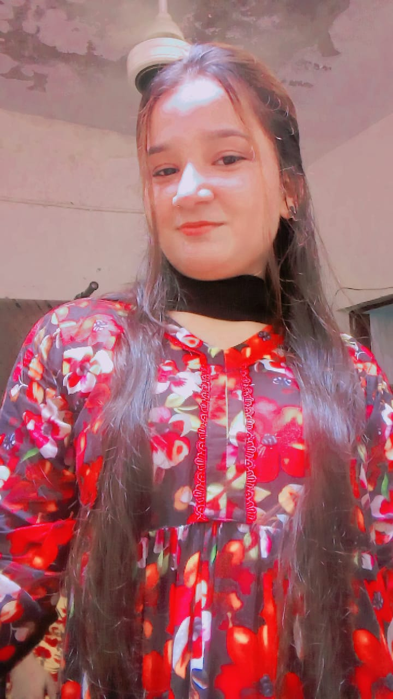

<!DOCTYPE html>
<html lang="en">
<head>
  <meta charset="UTF-8">
  <title>Happy Birthday Muskan</title>
  
</head>
<body>

  <!-- Page 1 -->
  

    <h1>🎂 Happy Birthday Muskan 🎉</h1>
    <a class="btn" onclick="nextPage(2)">Let's Start</a>
  

  <!-- Page 2 (Cake + Rainbow + Balloons) -->
  

    <h2>Here is your special Cake 🎂</h2>
    

    
🎂🕯🕯🕯

    <!-- Balloons -->
    
🎈

    
🎉

    
🎈

    
🎉

    
🎈

    
🎉

    <a class="btn" onclick="nextPage(3)">Next 🎈</a>
  

  <!-- Page 3 (Background Video) -->
  

    <!-- Background Video -->
    <video autoplay muted loop playsinline
      style="position:absolute; top:0; left:0; width:100%; height:100%; object-fit:cover; z-index:-1;">
      <source src="muskan.mp4" type="video/mp4">
      Your browser does not support the video tag.
    </video>

    <!-- Foreground Content -->
    

      <h2>🎥 A Special Surprise 🎉</h2>
      
Enjoy your day with this little magic ❤

      <a class="btn" onclick="nextPage(4)">Next ❤</a>
    

  

  <!-- Page 4 (Pictures only) -->
  

    <h2>🌟 Some Beautiful Memories 🌟</h2>
    

      
      
      
      
    

    <a class="btn" onclick="nextPage(5)">Next ➡ Wish</a>
  

  <!-- Page 5 (Wish with custom background image) -->
  

    

      💌 <strong>Happy Birthday My Bhabhi, Muskan! 🎉❤</strong>  
      Aaj ka din tumhari zindagi ka sabse khaas din hai, 
      aur meri dua hai ke tumhari zindagi hamesha khushiyon se bhari rahe. 🌸  
      Tum meri duaon ka woh hissa ho jo kabhi adhoora nahi hota, 
      meri muskaan ka woh sabab ho jo kabhi khatam nahi hota. 💕  
      Allah tumhari zindagi mein hamesha barkat aur mohabbat bhar de, 
      tumhari har dua qubool ho, aur tumhari har muskaan hamesha qayam rahe. ✨  
      Tum meri duniya ka sabse khoobsurat tohfa ho… 
      Aur meri zindagi ka sabse pyara hissaa bhi. 💖  
      <strong>I love you forever… Happy Birthday Muskan! 🎂🎈</strong>
    

  

  

</body>
</html>
